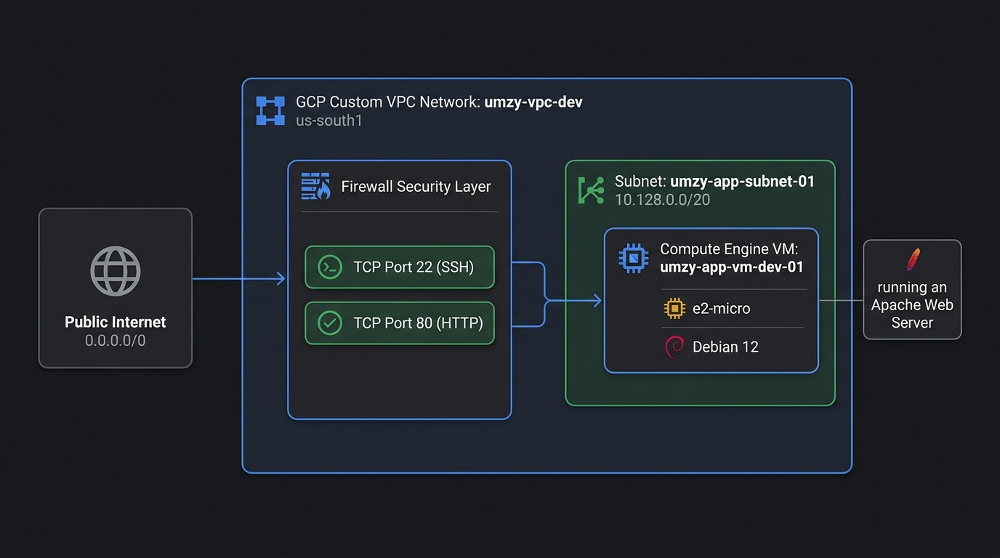
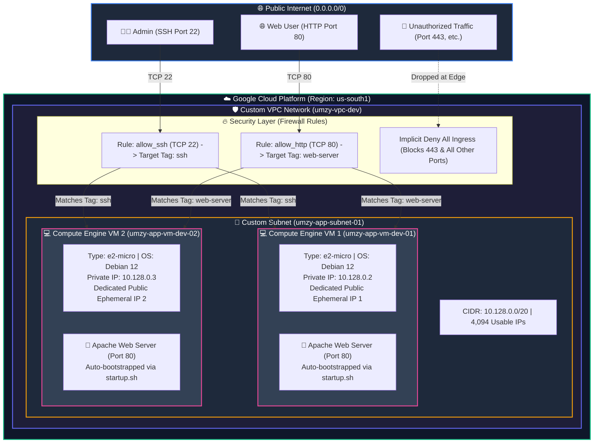
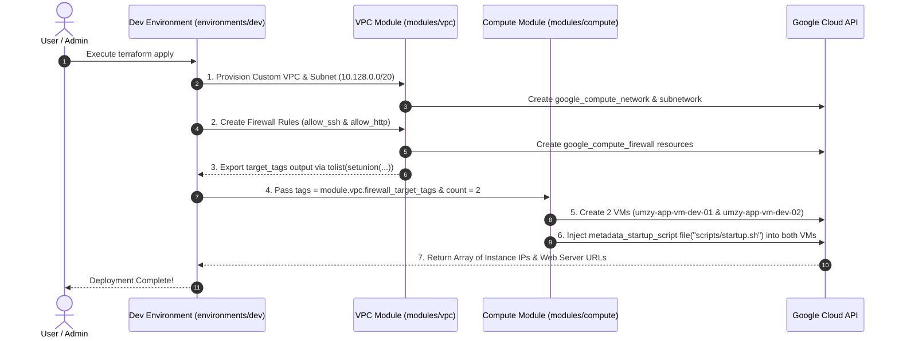

<link rel="stylesheet" href="https://fonts.googleapis.com/css2?family=Ubuntu:ital,wght@0,300;0,400;0,500;0,700;1,400&display=swap">

<div style="font-family: 'Ubuntu', 'Segoe UI', Tahoma, Geneva, Verdana, sans-serif;">

# Enterprise GCP Cloud Architecture & Terraform Automation

Welcome to the **Modular GCP Infrastructure Repository**. This project provisions a secure, highly scalable, and enterprise-compliant Google Cloud Platform (GCP) environment using **Terraform (Infrastructure as Code - IaC)**.

---

## 📸 High-Resolution Architecture Diagram

<p align="center">
  
</p>

---

## 📐 Visual Architecture Blueprints

### A. End-to-End GCP Network & Security Flow



---

### B. Dynamic Terraform Module & Dependency Sequence



---

## 🎯 Architecture Explanation & Technical Design Deep-Dive

### 1. Network Topology & Subnet Engineering
* **Custom VPC Network Isolation:**
  Default GCP networks auto-provision subnets across every global region, introducing unnecessary attack surface and overlapping IP space. This architecture explicitly creates a **Custom VPC Network** (`auto_create_subnetworks = false`), granting total control over subnetwork placement, routing tables, and perimeter boundaries.
* **`/20` Subnetwork Capacity Planning:**
  The subnetwork (`umzy-app-subnet-01`) is configured with a `/20` IPv4 CIDR range (`10.128.0.0/20`), providing **4,094 usable host IP addresses** (`10.128.0.1` to `10.128.15.254`). This sizing satisfies enterprise growth requirements for running auto-scaling Compute groups, Google Kubernetes Engine (GKE) nodes, and internal Load Balancers.

---

### 2. Zero-Trust Perimeter & Security Governance
* **Implicit Deny Ingress Model:**
  GCP VPC networks operate under a strict default-deny policy for incoming traffic. No ports are reachable from the public internet unless an explicit `google_compute_firewall` ingress resource is defined.
* **Tag-Based Firewalls (Least-Privilege Enforcement):**
  Instead of binding firewall rules to static IP addresses or applying them network-wide, access is granted strictly to workloads bearing specific **Network Tags**:
  * **`allow_ssh`:** Opens TCP Port 22 only to instances bearing the `ssh` network tag.
  * **`allow_http`:** Opens TCP Port 80 only to instances bearing the `web-server` network tag.
  * **Default Blocked Traffic:** Port 443 (HTTPS) and all unlisted ports are blocked at the GCP edge boundary.
* **Dynamic Dependency Chaining (Zero Hardcoding):**
  The VPC module dynamically collects target tags using `tolist(setunion(google_compute_firewall.allow_ssh.target_tags, google_compute_firewall.allow_http.target_tags))` and exports them via `firewall_target_tags`. The Compute module consumes this output (`tags = module.vpc.firewall_target_tags`), ensuring that any modification to firewall rules instantly updates the VM tags without requiring code refactoring.

---

### 3. Compute Layer & Automated Bootstrapping Lifecycle
* **Compute Instance Profile:**
  Provisioned using `google_compute_instance` configured with cost-optimized compute profiles (`e2-micro` for development, `e2-standard-2` for production) running `Debian 12 Bookworm`.
* **Public Internet Gateway:**
  Each VM includes an `access_config {}` block under its `network_interface` mapping, assigning a public ephemeral IPv4 address to enable direct HTTP/SSH access and outbound internet connectivity.
* **Out-of-Band Application Bootstrapping:**
  Software installation is externalized via Terraform's `file("${path.module}/scripts/startup.sh")` function. During VM initialization, GCP's metadata agent executes the script to:
  1. Update Debian package repositories and install `apache2` and `curl`.
  2. Enable and start the Apache web service.
  3. Query GCP's internal metadata server (`http://metadata.google.internal/computeMetadata/v1/`) for runtime metrics (hostname, internal IP, external IP, app version).
  4. Dynamically generate `/var/www/html/index.html` to present live system information upon deployment.

---

### 4. Modular Infrastructure Blueprint & State Parity
* **DRY (Don't Repeat Yourself) Modularization:**
  Infrastructure definitions are split into reusable modules (`modules/vpc` and `modules/compute`). Environment root modules (`environments/dev` and `environments/prod`) invoke identical underlying modules with environment-specific input variables.
* **Environment State Isolation:**
  `dev` and `prod` maintain isolated Terraform state files, preventing accidental state contamination or blast-radius propagation during maintenance runs.

---

## 🗂️ Repository Directory Structure

```text
umzy-gcp-terraform/
├── README.md                      # Architecture blueprint & execution guide
├── gcp_architecture_diagram.jpg   # Architecture diagram visual asset
├── main.tf                        # Root entrypoint
├── provider.tf                    # Root GCP provider settings (Region: us-south1)
├── variables.tf                   # Global input variables
├── terraform.tfvars               # Global variable overrides
├── outputs.tf                     # Global project outputs
├── compliance/                    # Compliance & audit logging directory
├── modules/                       # Reusable Core Infrastructure Modules
│   ├── vpc/                       # Custom VPC, Subnet, and Firewall Rules
│   │   ├── vpc.tf                 # Network & Subnet resource declarations
│   │   ├── firewall.tf            # SSH (22) and HTTP (80) Firewall rules
│   │   ├── variables.tf           # Module input variables
│   │   └── outputs.tf             # Outputs & Dynamic target_tags
│   └── compute/               # Compute Engine VM Module
│       ├── compute.tf             # Compute instance & boot disk declaration
│       ├── variables.tf           # Module input variables
│       ├── outputs.tf             # Instance IP & Web Server URL outputs
│       └── scripts/
│           └── startup.sh         # Apache installation & dynamic HTML metadata script
└── environments/                  # Environment Invocations
    ├── dev/                       # Development Environment (Active)
    │   ├── main.tf                # Invokes VPC & Compute modules
    │   ├── variables.tf           # Dev environment variables
    │   ├── terraform.tfvars       # Dev environment values (IP CIDR, Instance Name)
    │   ├── provider.tf            # Provider configuration
    │   └── outputs.tf             # Dev environment outputs
    └── prod/                      # Production Environment
        ├── main.tf                # Invokes VPC & Compute modules
        ├── variables.tf           # Prod environment variables
        ├── terraform.tfvars       # Prod-specific values
        ├── provider.tf            # Provider configuration
        └── outputs.tf             # Prod environment outputs
```

---

## 📊 Environment Specification Matrix

| Attribute | Development (`dev`) | Production (`prod`) |
| :--- | :--- | :--- |
| **VPC Network Name** | `umzy-vpc-dev` | `umzy-vpc-prod` |
| **Subnet Name** | `umzy-app-subnet-01` | `umzy-app-subnet-01` |
| **Subnet CIDR Range** | `10.128.0.0/20` (4,094 IPs) | `10.128.0.0/20` (4,094 IPs) |
| **VM Instance Names** | `umzy-app-vm-dev-01`, `umzy-app-vm-dev-02` (2 VMs) | `umzy-app-vm-prod-01`, `umzy-app-vm-prod-02` (2 VMs) |
| **Public Ephemeral IPs** | Dedicated Public IP per VM instance | Dedicated Public IP per VM instance |
| **Compute Profile** | `e2-micro` (0.25–2 vCPU, 1 GB RAM) | `e2-standard-2` (2 vCPU, 8 GB RAM) |
| **OS Distribution** | `Debian 12 Bookworm` | `Debian 12 Bookworm` |
| **GCP Region / Zone** | `us-south1` (`us-south1-a`) | `us-south1` (`us-south1-a`) |
| **Firewall Target Tags** | `["ssh", "web-server"]` | `["ssh", "web-server"]` |

---

## 🛠️ CLI Execution Commands

### 1. Authenticate with GCP
```bash
gcloud auth application-default login
```

### 2. Deploy Environment (`dev`)
```bash
cd environments/dev
terraform init
terraform plan
terraform apply -auto-approve
```

### 3. Teardown Environment (`dev`)
```bash
cd environments/dev
terraform destroy -auto-approve
```

</div>
