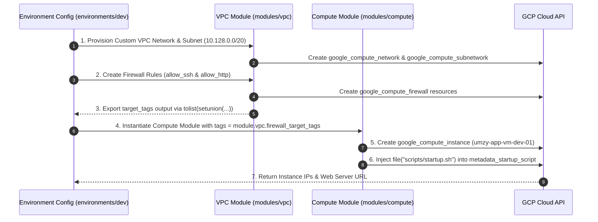

# Enterprise GCP Cloud Architecture & Terraform Automation

Welcome to the **Modular GCP Infrastructure Repository**. This project provisions a secure, highly scalable, and enterprise-compliant Google Cloud Platform (GCP) environment using **Terraform (Infrastructure as Code - IaC)**.

This document serves as both a **technical execution guide** and an **architecture blueprint** to help you explain what is being built, why key design decisions were made, and how the components interact.

---

## 📐 1. Visual Architecture Diagrams

### A. End-to-End GCP Network & Compute Architecture

```mermaid
flowchart TD
    subgraph Internet ["🌐 Public Internet (0.0.0.0/0)"]
        UserSSH["👨‍💻 Admin (SSH / Port 22)"]
        UserHTTP["🌐 Web User (HTTP / Port 80)"]
        BlockedTraffic["🚫 Unauthorized Traffic (Port 443, etc.)"]
    </div>

    subgraph GCPCloud ["☁️ Google Cloud Platform (GCP - Region: us-south1)"]
        subgraph VPC ["🛡️ Custom VPC Network (umzy-vpc-dev)"]
            
            subgraph FirewallLayer ["🔥 Security Layer (Firewall Rules)"]
                FW_SSH["Rule 1: allow_ssh\n• Port: 22 (TCP)\n• Target Tag: 'ssh'"]
                FW_HTTP["Rule 2: allow_http\n• Port: 80 (TCP)\n• Target Tag: 'web-server'"]
                FW_DENY["Implicit Deny All Ingress\n(Blocks 443 & all other ports)"]
            end

            subgraph Subnet ["📍 Custom Subnetwork (umzy-app-subnet-01)"]
                SubnetCIDR["CIDR: 10.128.0.0/20 (4,094 usable IPs)\nGateway: 10.128.0.1"]
                
                subgraph VMInstance ["💻 Compute Engine VM (umzy-app-vm-dev-01)"]
                    InstanceConfig["• Machine Type: e2-micro\n• OS Image: Debian 12\n• Private IP: 10.128.0.2\n• Public Ephemeral IP: Access Config"]
                    
                    subgraph StartupBoot ["🚀 Startup Script Execution"]
                        Apache["Apache Web Server (Port 80)\nServes Metadata Landing Page"]
                    end
                end
            end
        end
    end

    UserSSH -->|TCP 22| FW_SSH
    UserHTTP -->|TCP 80| FW_HTTP
    BlockedTraffic -.->|Dropped at Edge| FW_DENY

    FW_SSH -->|Matches Tag: ssh| VMInstance
    FW_HTTP -->|Matches Tag: web-server| VMInstance
    SubnetCIDR --- VMInstance
```

---

### B. Dynamic Terraform Module & Security Dependency Flow



---

## 🎯 2. What Are We Building? (Architecture Narrative)

### The Problem We Are Solving
In many legacy cloud setups, infrastructure is created manually via cloud consoles, leading to "configuration drift," exposed ports, and hardcoded security rules. 

### The Solution We Implemented
We have engineered a **Zero-Trust, Modular Infrastructure-as-Code Foundation** in GCP that establishes:

1. **Strict Perimeter Security (Custom VPC vs Default VPC):**
   * GCP's `default` VPC network comes pre-loaded with open firewall rules and automatic subnetting. We disabled auto-subnets (`auto_create_subnetworks = false`) and built a custom VPC network (`umzy-vpc-dev`).
   * By default, **all inbound traffic is denied**. We explicitly open only TCP Port 22 (SSH) and TCP Port 80 (HTTP). Port 443 and all other unused ports are strictly blocked at the GCP edge.

2. **Enterprise Subnet Sizing (`10.128.0.0/20`):**
   * Instead of small `/24` subnets (254 IPs), we allocated a `/20` CIDR block (`10.128.0.0/20`). This yields **4,094 usable private IP addresses**, providing room for Kubernetes clusters (GKE), load balancers, and autoscaling instance groups.

3. **Dynamic Security Propagation (Zero Hardcoding):**
   * Firewall rules are decoupled from compute instances using **Network Tags** (`ssh`, `web-server`).
   * The VPC module exports its firewall target tags (`firewall_target_tags`) dynamically. When the Compute Engine VM is provisioned, Terraform references these outputs directly (`tags = module.vpc.firewall_target_tags`). If security tags change in the firewall module, the VM updates automatically.

4. **Automated Application Provisioning (Metadata Startup Script):**
   * Instead of manually SSHing into virtual machines to install software, application bootstrapping is fully automated via an external script (`modules/compute/scripts/startup.sh`).
   * Upon instance boot, the metadata script installs Apache, queries GCP instance metadata endpoints (hostname, internal IP, public IP, version), and serves a dynamic landing page.

---

## 🗂️ 3. Repository Directory Structure

```text
umzy-gcp-terraform/
├── README.md                      # Architecture blueprint & execution guide
├── main.tf                        # Root entrypoint
├── provider.tf                    # GCP provider settings (Region: us-south1)
├── variables.tf                   # Global input variables
├── terraform.tfvars               # Global variable overrides
├── outputs.tf                     # Global project outputs
├── compliance/                    # Compliance & audit logging directory
├── modules/                       # Reusable Core Infrastructure Modules
│   ├── vpc/                       # Custom VPC, Subnet, and Firewall Rules
│   │   ├── vpc.tf                 # Network & Subnet resource declarations
│   │   ├── firewall.tf            # SSH (22) and HTTP (80) Firewall rules
│   │   ├── variables.tf           # Module input variables
│   │   └── outputs.tf             # Outputs & Dynamic target_tags
│   └── compute/               # Compute Engine VM Module
│       ├── compute.tf             # Compute instance & boot disk declaration
│       ├── variables.tf           # Module input variables
│       ├── outputs.tf             # Instance IP & Web Server URL outputs
│       └── scripts/
│           └── startup.sh         # Apache installation & dynamic HTML metadata script
└── environments/                  # Environment Invocations
    ├── dev/                       # Development Environment (Active)
    │   ├── main.tf                # Invokes VPC & Compute modules
    │   ├── variables.tf           # Dev environment variables
    │   ├── terraform.tfvars       # Dev environment values (IP CIDR, Instance Name)
    │   ├── provider.tf            # Provider configuration
    │   └── outputs.tf             # Dev environment outputs
    └── prod/                      # Production Environment
        ├── main.tf                # Invokes VPC & Compute modules
        ├── variables.tf           # Prod environment variables
        ├── terraform.tfvars       # Prod-specific values
        ├── provider.tf            # Provider configuration
        └── outputs.tf             # Prod environment outputs
```

---

## 📊 4. Environment Specification Matrix

| Attribute | Development (`dev`) | Production (`prod`) |
| :--- | :--- | :--- |
| **VPC Network Name** | `umzy-vpc-dev` | `umzy-vpc-prod` |
| **Subnet Name** | `umzy-app-subnet-01` | `umzy-app-subnet-01` |
| **Subnet CIDR Range** | `10.128.0.0/20` (4,094 IPs) | `10.128.0.0/20` (4,094 IPs) |
| **VM Instance Name** | `umzy-app-vm-dev-01` | `umzy-app-vm-prod-01` |
| **Compute Profile** | `e2-micro` (0.25–2 vCPU, 1 GB RAM) | `e2-standard-2` (2 vCPU, 8 GB RAM) |
| **OS Distribution** | `Debian 12 Bookworm` | `Debian 12 Bookworm` |
| **GCP Region / Zone** | `us-south1` (`us-south1-a`) | `us-south1` (`us-south1-a`) |
| **Firewall Target Tags** | `["ssh", "web-server"]` | `["ssh", "web-server"]` |

---

## 🗣️ 5. How to Explain This Architecture to a Customer

When presenting this solution to stakeholders, use these key talking points:

### Executive Summary (for Leadership / Non-Technical Stakeholders)
> *"We have built a secure, automated cloud foundation in GCP using Terraform. Instead of manually configuring servers, our infrastructure is defined entirely as code. This allows us to provision complete environments in under two minutes with guaranteed consistency and zero human error."*

### Technical Deep Dive (for Architects / Security Teams)
> *"Our architecture implements a Zero-Trust Custom VPC network in GCP Dallas (`us-south1`). We enforce perimeter security by disabling auto-subnets and dropping all inbound traffic by default. We dynamically bind firewall rules for SSH (port 22) and HTTP (port 80) using network tags exported from the VPC module. The VM instance is provisioned on a `/20` subnet and automatically bootstraps its web server application via a metadata startup script upon boot."*

---

## 🛠️ 6. CLI Execution Commands

### Step 1: Authenticate with GCP
```bash
gcloud auth application-default login
```

### Step 2: Deploy Environment (`dev`)
```bash
cd environments/dev
terraform init
terraform plan
terraform apply -auto-approve
```

### Step 3: Access Web Server Endpoint
After deployment completes, query the output URL:
```bash
# Output example:
# web_server_url = "http://34.174.182.140"
curl http://34.174.182.140
```

### Step 4: Teardown Environment (`dev`)
```bash
cd environments/dev
terraform destroy -auto-approve
```
