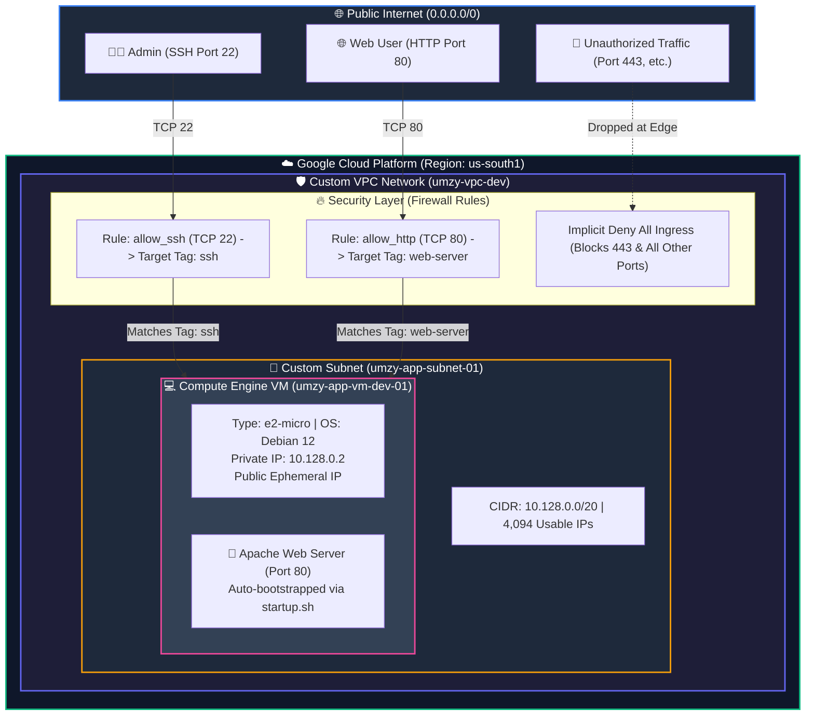
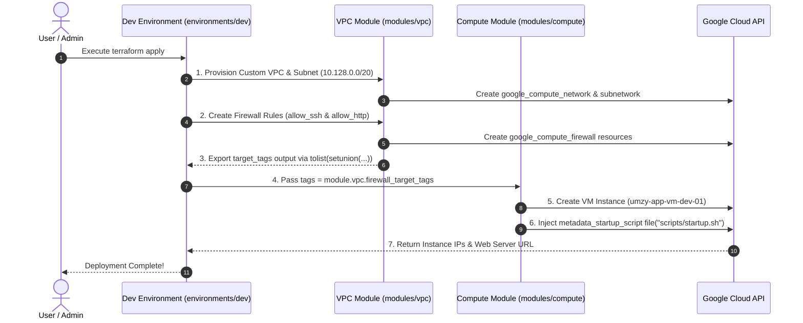

# Enterprise GCP Cloud Architecture & Terraform Automation

Welcome to the **Modular GCP Infrastructure Repository**. This project provisions a secure, highly scalable, and enterprise-compliant Google Cloud Platform (GCP) environment using **Terraform (Infrastructure as Code - IaC)**.

---

## 📸 High-Resolution Architecture Diagram


---

## 📐 Visual Architecture Blueprints

### A. End-to-End GCP Network & Security Flow



---

### B. Dynamic Terraform Module & Dependency Sequence



---

## 🎯 What Are We Building? (Customer-Ready Architecture Explanation)

### The Problem We Solved
In legacy setups, cloud infrastructure is provisioned manually through web consoles, creating security vulnerabilities, open ports, and configuration drift. 

### The Enterprise Architecture We Engineered
We designed a **Zero-Trust, Modular Infrastructure-as-Code Foundation** in GCP:

1. **Perimeter Security (Custom VPC vs Default VPC):**
   * Default GCP networks come pre-configured with open ports. We created a **Custom VPC Network** (`umzy-vpc-dev`) with `auto_create_subnetworks = false`.
   * **Inbound traffic is blocked by default**. Only TCP Port 22 (SSH) and TCP Port 80 (HTTP) are exposed to matching instances. Unused ports (including 443) are blocked at the GCP boundary.

2. **Scalable Subnet Sizing (`10.128.0.0/20`):**
   * Configured with a `/20` CIDR block (`10.128.0.0/20`), providing **4,094 private IP addresses** per environment to support autoscaling, Kubernetes (GKE), and load balancers.

3. **Dynamic Network Tag Propagation (Zero Hardcoding):**
   * Firewall rules target specific network tags (`ssh`, `web-server`).
   * The VPC module exports its target tags (`firewall_target_tags`). The Compute module dynamically references these outputs (`tags = module.vpc.firewall_target_tags`), ensuring automatic tag propagation across infrastructure updates.

4. **Automated Bootstrapping (Metadata Startup Script):**
   * Software installation is automated on first boot using an external metadata startup script (`modules/compute/scripts/startup.sh`).
   * Upon boot, the script installs Apache, queries instance metadata (hostname, internal IP, public IP, version), and serves a live dynamic web page.

---

## 🗂️ Repository Directory Structure

```text
umzy-gcp-terraform/
├── README.md                      # Architecture blueprint & execution guide
├── gcp_architecture_diagram.jpg   # Architecture diagram visual asset
├── main.tf                        # Root entrypoint
├── provider.tf                    # Root GCP provider settings (Region: us-south1)
├── variables.tf                   # Global input variables
├── terraform.tfvars               # Global variable overrides
├── outputs.tf                     # Global project outputs
├── compliance/                    # Compliance & audit logging directory
├── modules/                       # Reusable Core Infrastructure Modules
│   ├── vpc/                       # Custom VPC, Subnet, and Firewall Rules
│   │   ├── vpc.tf                 # Network & Subnet resource declarations
│   │   ├── firewall.tf            # SSH (22) and HTTP (80) Firewall rules
│   │   ├── variables.tf           # Module input variables
│   │   └── outputs.tf             # Outputs & Dynamic target_tags
│   └── compute/               # Compute Engine VM Module
│       ├── compute.tf             # Compute instance & boot disk declaration
│       ├── variables.tf           # Module input variables
│       ├── outputs.tf             # Instance IP & Web Server URL outputs
│       └── scripts/
│           └── startup.sh         # Apache installation & dynamic HTML metadata script
└── environments/                  # Environment Invocations
    ├── dev/                       # Development Environment (Active)
    │   ├── main.tf                # Invokes VPC & Compute modules
    │   ├── variables.tf           # Dev environment variables
    │   ├── terraform.tfvars       # Dev environment values (IP CIDR, Instance Name)
    │   ├── provider.tf            # Provider configuration
    │   └── outputs.tf             # Dev environment outputs
    └── prod/                      # Production Environment
        ├── main.tf                # Invokes VPC & Compute modules
        ├── variables.tf           # Prod environment variables
        ├── terraform.tfvars       # Prod-specific values
        ├── provider.tf            # Provider configuration
        └── outputs.tf             # Prod environment outputs
```

---

## 📊 Environment Specification Matrix

| Attribute | Development (`dev`) | Production (`prod`) |
| :--- | :--- | :--- |
| **VPC Network Name** | `umzy-vpc-dev` | `umzy-vpc-prod` |
| **Subnet Name** | `umzy-app-subnet-01` | `umzy-app-subnet-01` |
| **Subnet CIDR Range** | `10.128.0.0/20` (4,094 IPs) | `10.128.0.0/20` (4,094 IPs) |
| **VM Instance Name** | `umzy-app-vm-dev-01` | `umzy-app-vm-prod-01` |
| **Compute Profile** | `e2-micro` (0.25–2 vCPU, 1 GB RAM) | `e2-standard-2` (2 vCPU, 8 GB RAM) |
| **OS Distribution** | `Debian 12 Bookworm` | `Debian 12 Bookworm` |
| **GCP Region / Zone** | `us-south1` (`us-south1-a`) | `us-south1` (`us-south1-a`) |
| **Firewall Target Tags** | `["ssh", "web-server"]` | `["ssh", "web-server"]` |

---

## 🗣️ How to Explain This Architecture to a Customer

### Executive Summary (for Leadership / Non-Technical Stakeholders)
> *"We have built a secure, automated cloud foundation in GCP using Terraform. Instead of manually configuring servers, our infrastructure is defined entirely as code. This allows us to provision complete environments in under two minutes with guaranteed consistency and zero human error."*

### Technical Deep Dive (for Cloud Architects & Security Teams)
> *"Our architecture implements a Zero-Trust Custom VPC network in GCP Dallas (`us-south1`). We enforce perimeter security by disabling auto-subnets and dropping all inbound traffic by default. We dynamically bind firewall rules for SSH (port 22) and HTTP (port 80) using network tags exported from the VPC module. The VM instance is provisioned on a `/20` subnet and automatically bootstraps its web server application via a metadata startup script upon boot."*

---

## 🛠️ CLI Execution Commands

### 1. Authenticate with GCP
```bash
gcloud auth application-default login
```

### 2. Deploy Environment (`dev`)
```bash
cd environments/dev
terraform init
terraform plan
terraform apply -auto-approve
```

### 3. Teardown Environment (`dev`)
```bash
cd environments/dev
terraform destroy -auto-approve
```
