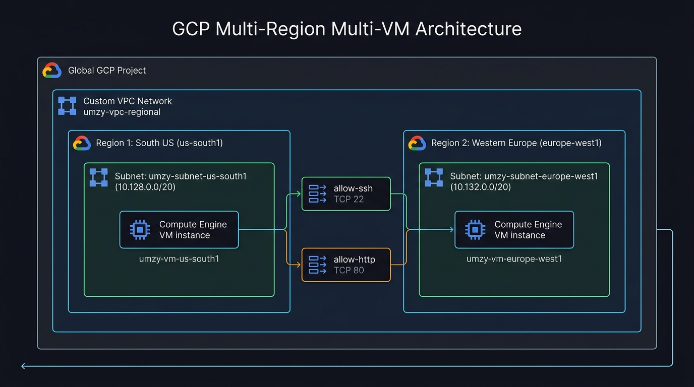
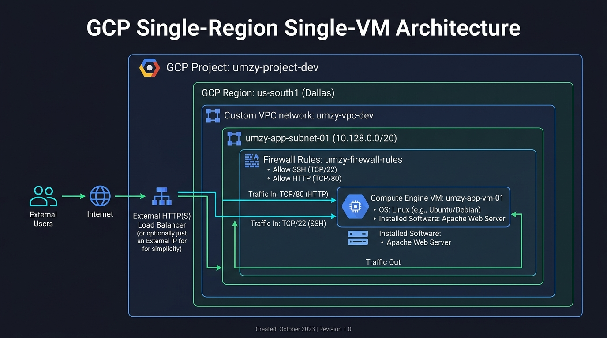
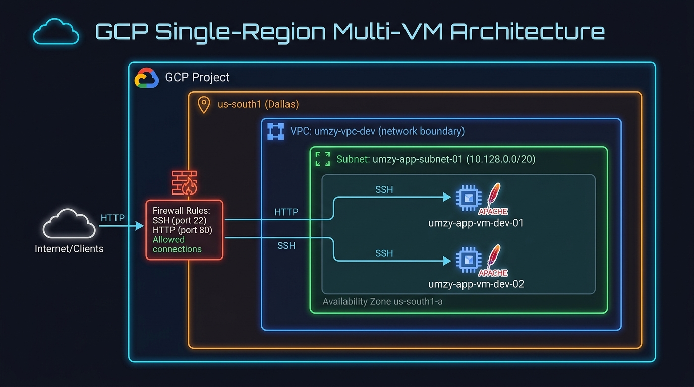
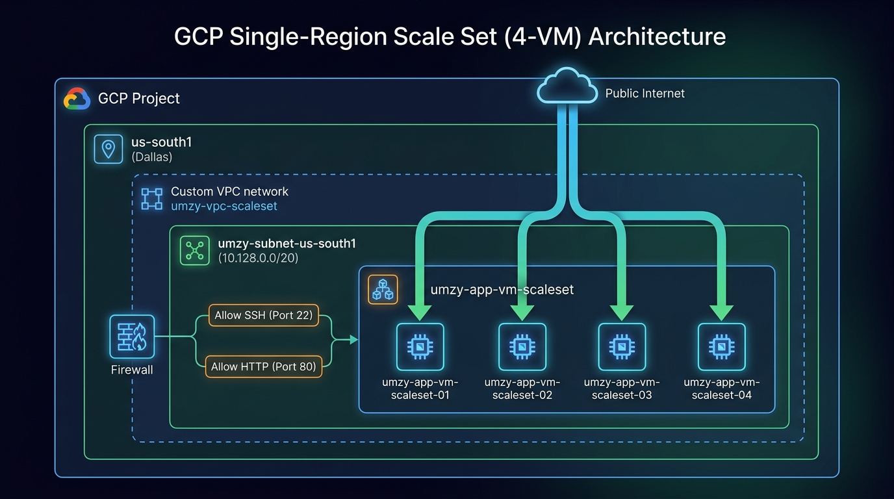
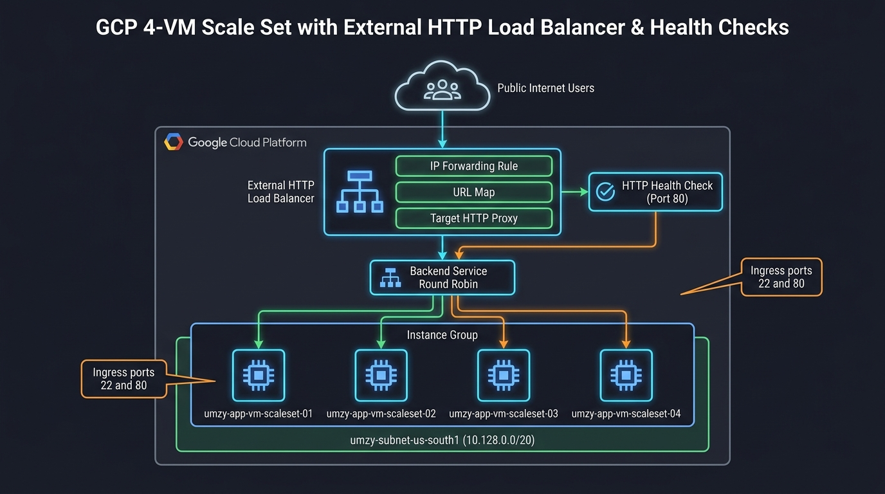

<link rel="stylesheet" href="https://fonts.googleapis.com/css2?family=Ubuntu:ital,wght@0,300;0,400;0,500;0,700;1,400&display=swap">

<div style="font-family: 'Ubuntu', 'Segoe UI', Tahoma, Geneva, Verdana, sans-serif;">

# Enterprise GCP Cloud Architecture & Terraform Automation

Welcome to the **Modular GCP Infrastructure Repository**. This project provides an enterprise-grade Infrastructure as Code (IaC) setup using **Terraform**, supporting multiple architectural scenarios ranging from **Single-Region Single-VM**, **Single-Region Multi-VM**, **Multi-Region Multi-VM**, **Single-Region 4-VM Scale Set**, to **External HTTP Load Balanced Scale Set with Health Checks**.

Detailed architecture blueprints and flow charts are indexed in [`docs/ARCHITECTURE_DIAGRAMS.md`](docs/ARCHITECTURE_DIAGRAMS.md).

---

## 📸 Primary Architecture Diagram (Multi-Region Multi-VM)

<p align="center">
  
</p>

---

## 📸 Architecture Blueprints by Scenario

### Scenario 1: Single Region, Single VM (`umzy-singlevm-single-region`)
<p align="center">
  
</p>

---

### Scenario 2: Single Region, Multi VM (`umzy-multivm-single-region`)
<p align="center">
  
</p>

---

### Scenario 3: Multi Region, Multi VM (`umzy-multivm-regional`)
<p align="center">
  
</p>

---

### Scenario 4: Single Region, 4-VM Scale Set (`umzy-scaleset-single-region`)
<p align="center">
  
</p>

---

### Scenario 5: External HTTP Load Balancer & Health Checks (`umzy-loadbalanced-scaleset`)
<p align="center">
  
</p>

---

## 📐 Interactive Architecture Scenarios Matrix

| Scenario Architecture | Project ID | Regions / Zones | Subnet Name & CIDR | VM Workloads & LB | Execution Profile |
| :--- | :--- | :--- | :--- | :--- | :--- |
| **Scenario 1: Single Region, Single VM** | `project-f69b612e` | `us-south1` (`us-south1-a`) | `umzy-app-subnet-01`<br/>(`10.128.0.0/20`) | 1 VM (`umzy-app-vm-01`) | `terraform apply` |
| **Scenario 2: Single Region, Multi VM** | `project-f69b612e` | `us-south1` (`us-south1-a`) | `umzy-app-subnet-01`<br/>(`10.128.0.0/20`) | 2 VMs (`umzy-app-vm-dev-01`, `02`) | `-var-file="single-region.tfvars"` |
| **Scenario 3: Multi Region, Multi VM** | `project-f69b612e` | `us-south1` & `europe-west1` | `umzy-subnet-us-south1` (`10.128.0.0/20`)<br/>`umzy-subnet-europe-west1` (`10.132.0.0/20`) | 2 VMs across regions (`us-south1` & `europe-west1`) | `-var-file="multi-region.tfvars"` |
| **Scenario 4: Single Region, 4-VM Scale Set** | `project-f69b612e` | `us-south1` (`us-south1-a`) | `umzy-subnet-us-south1`<br/>(`10.128.0.0/20`) | 4 Scale-Set VMs (`umzy-app-vm-scaleset-01..04`) | `-var-file="scale-set.tfvars"` |
| **Scenario 5: External HTTP Load Balancer** | `project-f69b612e` | `us-south1` (`us-south1-a`) | `umzy-subnet-us-south1`<br/>(`10.128.0.0/20`) | 4 VMs + HTTP Load Balancer (Round Robin) | `-var-file="load-balancer.tfvars"` |

---

## 🗂️ Repository Directory Structure

```text
umzy-gcp-terraform/
├── README.md                      # Primary blueprint & execution documentation
├── docs/                          # Architecture Diagrams & Blueprint Docs
│   └── ARCHITECTURE_DIAGRAMS.md   # Deep-dive diagrams for all 5 scenarios
├── gcp_architecture_diagram.jpg   # Primary architecture visual asset (Multi-Region)
├── gcp_multiregion_diagram.jpg    # Multi-Region Multi-VM visual asset
├── gcp_singlevm_diagram.jpg       # Single-Region Single-VM visual asset
├── gcp_multivm_singleregion_diagram.jpg # Single-Region Multi-VM visual asset
├── gcp_scaleset_diagram.jpg       # Single-Region 4-VM Scale Set visual asset
├── gcp_lb_scaleset_diagram.jpg    # Load Balanced 4-VM Scale Set visual asset
├── compliance/                    # Compliance & audit logging index
│   ├── README.md                  # Audit Index
│   └── reports/                   # Timestamped execution reports (DEV-001..005)
├── modules/                       # Reusable Core Infrastructure Modules
│   ├── vpc/                       # Multi-Region Dynamic Subnet VPC Module (for_each)
│   ├── compute/                   # Reusable Compute Engine Module
│   ├── lb_http/                   # Reusable External HTTP Load Balancer Module
│   └── storage/                   # Reusable Storage Bucket Module Placeholder
└── environments/                  # Environment Workspaces
    ├── dev/                       # Development Workspace
    │   ├── main.tf                # Core module definitions
    │   ├── variables.tf           # Input variable schema
    │   ├── terraform.tfvars       # Default multi-region variable values
    │   ├── single-region.tfvars   # Scenario 2 profile (Single-Region 2-VM)
    │   ├── multi-region.tfvars    # Scenario 3 profile (Multi-Region Dallas + Europe)
    │   ├── scale-set.tfvars       # Scenario 4 profile (Single-Region 4-VM Scale Set)
    │   ├── load-balancer.tfvars   # Scenario 5 profile (Load Balanced 4-VM Scale Set)
    │   ├── provider.tf            # GCP provider configuration
    │   └── outputs.tf             # Outputs (Public IPs & Load Balancer URL)
    └── prod/                      # Production Workspace
        ├── main.tf                # Core module definitions
        ├── variables.tf           # Input variable schema
        ├── terraform.tfvars       # Multi-region production values
        ├── provider.tf            # Provider configuration
        └── outputs.tf             # Production outputs
```

---

## 🛠️ CLI Execution Commands (Scenario Profiles)

### 1. Authenticate with GCP
```bash
gcloud auth application-default login
```

### 2. Deploy Scenario 2: Single-Region 2-VM
```bash
cd environments/dev
terraform init
terraform apply -var-file="single-region.tfvars" -auto-approve
```

### 3. Deploy Scenario 3: Multi-Region Multi-VM (`umzy-multivm-regional`)
```bash
cd environments/dev
terraform init
terraform apply -var-file="multi-region.tfvars" -auto-approve
```

### 4. Deploy Scenario 4: Single-Region 4-VM Scale Set (`umzy-scaleset-single-region`)
```bash
cd environments/dev
terraform init
terraform apply -var-file="scale-set.tfvars" -auto-approve
```

### 5. Deploy Scenario 5: Load Balanced 4-VM Scale Set (`umzy-loadbalanced-scaleset`)
```bash
cd environments/dev
terraform init
terraform apply -var-file="load-balancer.tfvars" -auto-approve
```

### 6. Teardown Active Infrastructure
```bash
cd environments/dev
terraform destroy -auto-approve
```

</div>
