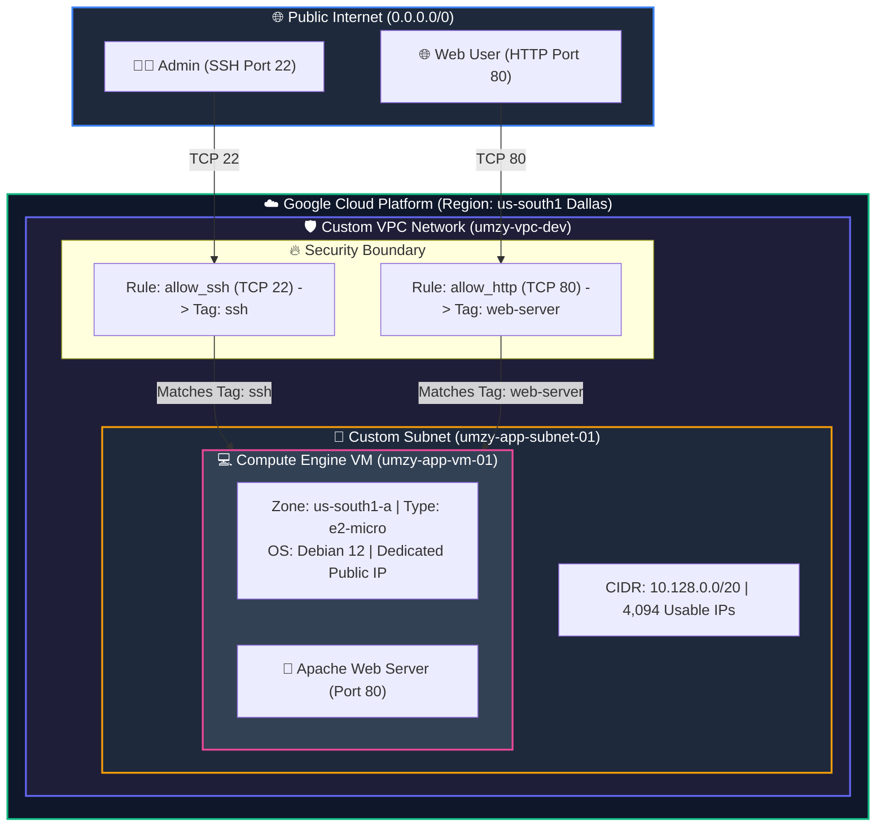
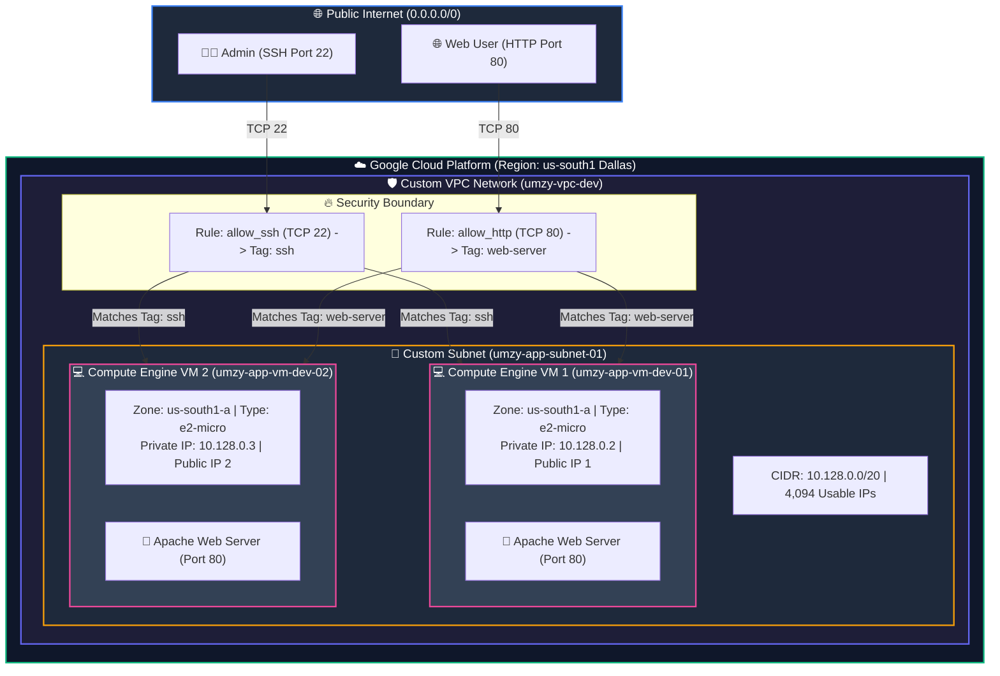

# GCP Infrastructure Architecture Diagrams

This document contains high-resolution visual blueprints and interactive Mermaid network flow diagrams for all supported architecture scenarios in the repository.

---

## 1. Single Region, Single VM Architecture (`umzy-singlevm-single-region`)

### Visual Diagram Blueprint


### Network & Security Flow


---

## 2. Single Region, Multi VM Architecture (`umzy-multivm-single-region`)

### Visual Diagram Blueprint


### Network & Security Flow


---

## 3. Multi Region, Multi VM Architecture (`umzy-multivm-regional`)

### Visual Diagram Blueprint


### Network & Security Flow
```mermaid
graph TD
    classDef internetStyle fill:#1e293b,stroke:#3b82f6,stroke-width:2px,color:#fff;
    classDef gcpStyle fill:#0f172a,stroke:#10b981,stroke-width:2px,color:#fff;
    classDef vpcStyle fill:#1e1e38,stroke:#6366f1,stroke-width:2px,color:#fff;
    classDef subnetStyle fill:#1e293b,stroke:#f59e0b,stroke-width:2px,color:#fff;
    classDef vmStyle fill:#334155,stroke:#ec4899,stroke-width:2px,color:#fff;

    subgraph IN ["🌐 Public Internet (0.0.0.0/0)"]
        A["👨‍💻 Global Admin (SSH Port 22)"]
        B["🌐 Web User (HTTP Port 80)"]
    end

    subgraph GCP ["☁️ Google Cloud Platform (Global Project: umzy-multivm-regional)"]
        subgraph VPC ["🛡️ Multi-Region Custom VPC (umzy-vpc-regional)"]
            subgraph FW ["🔥 Security Boundary"]
                FW1["Rule: allow_ssh (TCP 22) -> Tag: ssh"]
                FW2["Rule: allow_http (TCP 80) -> Tag: web-server"]
            end

            subgraph R1 ["📍 Region 1: South US (us-south1 / Dallas)"]
                subgraph SUB1 ["📍 Subnet: umzy-subnet-us-south1"]
                    S1_INFO["CIDR: 10.128.0.0/20 | 4,094 Usable IPs"]
                    subgraph VM1 ["💻 Compute Engine VM 1 (umzy-vm-us-south1)"]
                        VM1_INFO["Zone: us-south1-a | Type: e2-micro<br/>Private IP: 10.128.0.2 | Public IP 1"]
                        APP1["🚀 Apache Web Server (Port 80)"]
                    end
                end
            end

            subgraph R2 ["📍 Region 2: Western Europe (europe-west1 / Belgium)"]
                subgraph SUB2 ["📍 Subnet: umzy-subnet-europe-west1"]
                    S2_INFO["CIDR: 10.132.0.0/20 | 4,094 Usable IPs"]
                    subgraph VM2 ["💻 Compute Engine VM 2 (umzy-vm-europe-west1)"]
                        VM2_INFO["Zone: europe-west1-b | Type: e2-micro<br/>Private IP: 10.132.0.2 | Public IP 2"]
                        APP2["🚀 Apache Web Server (Port 80)"]
                    end
                end
            end
        end
    end

    A -->|TCP 22 (SSH Ingress)| FW1
    B -->|TCP 80 (HTTP Ingress)| FW2
    FW1 -->|Matches Tag: ssh| VM1
    FW1 -->|Matches Tag: ssh| VM2
    FW2 -->|Matches Tag: web-server| VM1
    FW2 -->|Matches Tag: web-server| VM2

    class IN internetStyle;
    class GCP gcpStyle;
    class VPC vpcStyle;
    class SUB1,SUB2 subnetStyle;
    class VM1,VM2 vmStyle;
```
